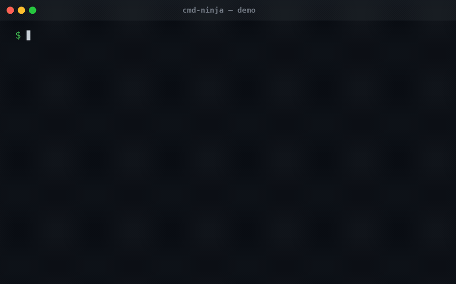
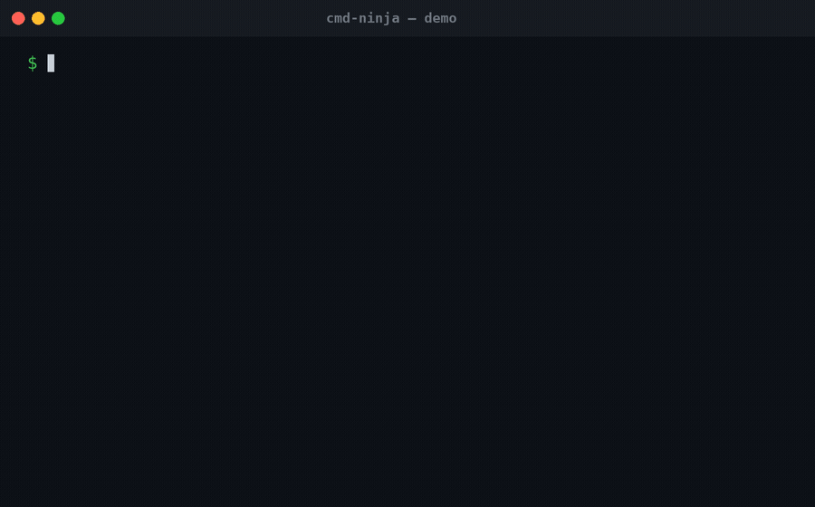
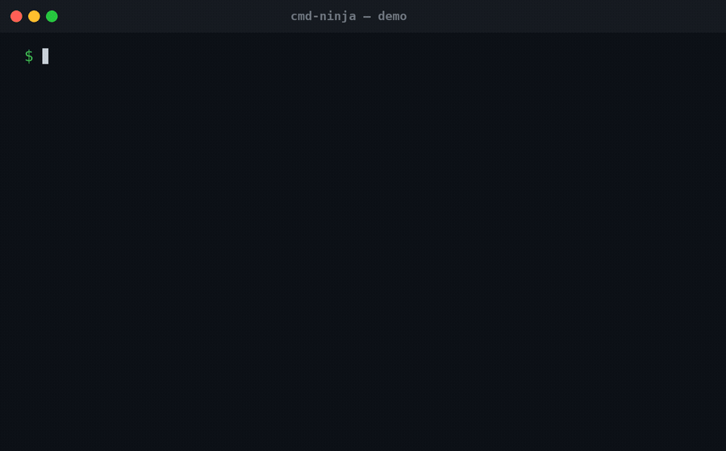
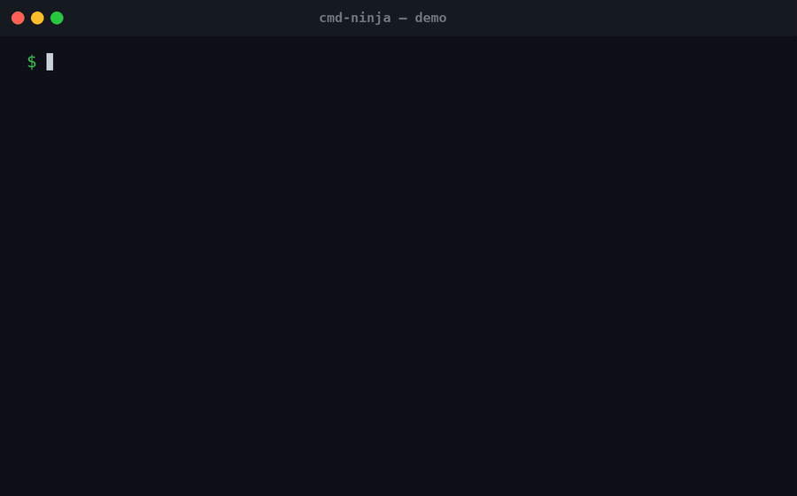
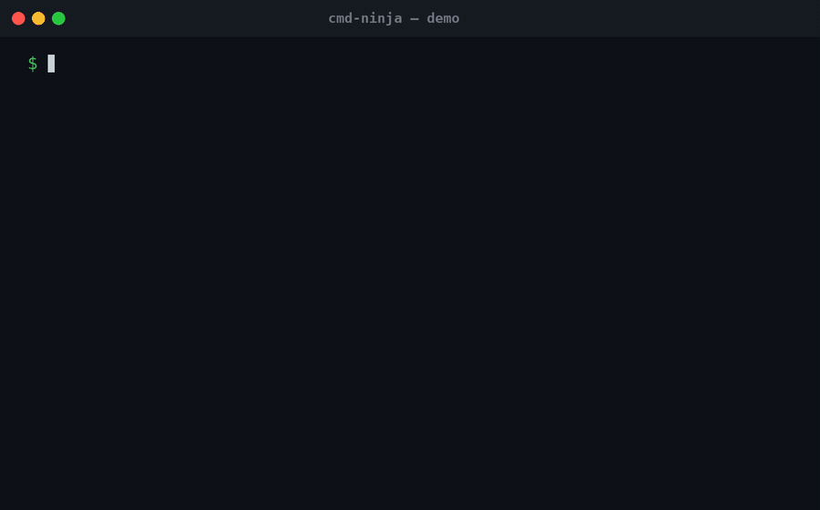

# Cmd Ninja

Type what you want in plain English at your shell prompt, hit `Ctrl-G`, and
Cmd Ninja shows you what each part of the command does, labels its risk, and
if it's safe, drops the real command **onto your prompt line**, ready for
Enter. If it's destructive, it shows the command but makes you type it
yourself. Nothing ever runs without you pressing **Enter**.



```
$ find every file over 100MB in this folder and below     ⌨  Ctrl-G

  INFO:
    find    : start a file search
    .       : ...in the current folder and below
    -type f : match files only (not directories)
    -size   : filter by size
    +100M   : larger than 100 megabytes

  RISK: read-only ✓     Shell: zsh (macOS)

$ find . -type f -size +100M█        ← command placed on prompt, press Enter
```

```
$ delete all the files in my-folder                       ⌨  Ctrl-G

  RISK: destructive ✗   Shell: zsh (macOS)

  CMD (copy or type it):  rm -rf my-folder
$ █                                   ← prompt left empty on purpose
```

## See it in action

| Docker | Kubernetes |
|---|---|
|  |  |
| **Git** | **Safety engine** |
|  |  |

## Requirements

- **Go 1.22+** to build (`brew install go` on macOS)
- **macOS or Linux** with **zsh**, **bash ≥ 4**, or **fish** (macOS ships bash 3.2, use zsh, or `brew install bash`)
- An API key for one of: Anthropic, Google Gemini, OpenAI, Mistral, Groq (or none there is an offline demo mode)

## Install

**1. Get the binary** (pick one)

```sh
# macOS / Linux with Homebrew (recommended — no Go needed):
brew install llm-books/tap/cmd-ninja

# Debian/Ubuntu — download the .deb from the releases page, then:
sudo dpkg -i cmd-ninja_*_linux_amd64.deb     # rpm/apk also available

# any platform, prebuilt tarball:
#   https://github.com/llm-books/cmd-ninja/releases  → extract → put `ninja` on PATH
#   (macOS: browser downloads are quarantined; run `xattr -d com.apple.quarantine ninja`)

# with Go installed:
go install github.com/llm-books/cmd-ninja@latest

# or build from source:
git clone https://github.com/llm-books/cmd-ninja && cd cmd-ninja && go build -o ninja .
ln -s "$PWD/ninja" /opt/homebrew/bin/ninja   # then put it on PATH
```

Heads-up: the binary name collides with the Ninja build system, if you have
that installed, rename this one (e.g. `nj`).

**2. Export your API key** (add to your rc file so it survives new terminals)

```sh
export ANTHROPIC_API_KEY=sk-ant-...     # Claude (the default provider)
# or:
export GEMINI_API_KEY=...               # then set provider: gemini (see Configure)
export OPENAI_API_KEY=sk-...            # then set provider: openai
export MISTRAL_API_KEY=...              # then set provider: mistral
export GROQ_API_KEY=gsk_...             # then set provider: groq
```

**3. Load the shell hook** (add to your rc file)

```sh
eval "$(ninja init zsh)"     # zsh  → ~/.zshrc
eval "$(ninja init bash)"    # bash → ~/.bashrc
ninja init fish | source     # fish → ~/.config/fish/config.fish
```

Open a new terminal, type `show the 5 biggest files in this folder`, press
`Ctrl-G`, and the command should land on your prompt.

To uninstall: remove the hook line from your rc file and delete the
symlink/binary. Nothing else is installed.

## Use it

**At the prompt (the main flow).** Type English, press `Ctrl-G`. Read-only,
file-modifying, and network commands are placed on your prompt for you to
review and Enter. Destructive ones are shown with an explanation but kept off
your prompt, retyping them mean you know what you are doing and avoids acidental press of Enter.

**As a plain CLI.** The suggested command is printed on the last line of
stdout, so it works in scripts and command substitution:

```sh
ninja translate -- "find all files under 10mb in my Documents folder"
ninja translate --provider openai -- "what is listening on port 8080"
ninja translate --dry-run -- "remove every node_modules folder"   # never fillable
```

Note the `--` before the request: it keeps words in your English from being
parsed as flags.

**Try it without any API key:**

```sh
ninja translate --provider stub -- "find big files"   # canned offline responses
```

**Things worth trying:**

- `show the 5 biggest files in my Downloads folder sorted by size`
- `which process is using the most memory right now`
- `undo my last git commit but keep the changes`
- `force push my branch to origin` watch it get withheld
- `wipe my home directory completely` watch it get BLOCKED

## Providers

| provider    | default model          | key read from       |
|-------------|------------------------|---------------------|
| `anthropic` | `claude-haiku-4-5`     | `ANTHROPIC_API_KEY` |
| `gemini`    | `gemini-2.5-flash`     | `GEMINI_API_KEY`    |
| `openai`    | `gpt-5-mini`           | `OPENAI_API_KEY`    |
| `mistral`   | `mistral-small-latest` | `MISTRAL_API_KEY`   |
| `groq`      | `llama-3.1-8b-instant` | `GROQ_API_KEY`      |
| `stub`      | offline, canned        | none                |

Switching is one config line (`provider: gemini`) model and key-env follow
automatically. The API key is **always** read from the environment, never
stored in a file. A one-line command translator doesn't need a frontier
model; the cheap/fast tier of any provider works well.

## Configure

Optional. Copy [config.yaml](config.yaml) to `~/.config/cmd-ninja/config.yaml`
(or point `$NINJA_CONFIG` at a file). Everything has a working default:

```yaml
provider: anthropic               # anthropic | gemini | openai | mistral | groq | stub
#model: claude-haiku-4-5          # override the provider's default model
#api_key_env: ANTHROPIC_API_KEY   # override which env var holds the key
hotkey: ctrl-g                    # the widget key, e.g. ctrl-n
teach: compact                    # off | compact | full (annotate every token)
safety:
  autofill: [read_only, modifies, network]   # tiers allowed onto your prompt
  block: [mkfs, "dd of=/dev/*"]              # extra patterns to refuse outright
  paranoid: false                            # true → only read-only autofills
```

## How safety works

Every suggested command is re-classified **locally and deterministically**.
The model's own risk label is never trusted, a hallucinating model cannot
downgrade its own command:

- **Layer A** regex rules for known-dangerous shapes (`rm -rf`, `dd of=/dev/...`, fork bombs, `curl | sh`, ...).
- **Layer B** argument inspection: tokenizes the command and reasons about targets (`rm -rf ./build` is destructive; `rm -rf ~` is blocked outright),
  redirect clobbers, `sudo`, pipes into bare shells, command substitution.

| Risk        | Prompt placement                  |
|-------------|-----------------------------------|
| read-only   | auto-filled, ready for Enter      |
| modifies    | auto-filled                       |
| network     | auto-filled (host shown in INFO)  |
| destructive | **not placed** copy or type it  |
| blocked     | **not placed**, refused           |

You can tighten placement in config (`paranoid: true`, a custom `block` list,
a smaller `autofill` list) but not loosen it past the hard floor: destructive
and blocked commands are never auto-placed, regardless of configuration.
The engine's test table (`internal/safety/rules_test.go`, ~130 adversarial
cases including flag-order swaps and obfuscations) must pass before anything
ships.

## Troubleshooting

| Symptom | Fix |
|---|---|
| `zsh: command not found: ninja` | The binary isn't on your PATH, see Install step 2, or set `NINJA_BIN=/path/to/ninja` before the `eval` line. |
| `unknown flag: --provider` | Flags belong to the subcommand: `ninja translate --provider ... -- "..."`. |
| `(no XXX_API_KEY set — using the offline stub provider)` | Export the key in the same shell (and rc file). The stub keeps the widget usable but only knows canned answers. |
| Gemini: `UNAVAILABLE: high demand` | Free-tier congestion on that model; retry, or set `model: gemini-2.5-flash-lite`. |
| `RESOURCE_EXHAUSTED` / quota errors | That model isn't included in your plan's tier, pick another model. |
| Ctrl-G does nothing | Another plugin may own the binding, set `hotkey: ctrl-n` (or similar) in config and re-`eval` the hook. |
| bash: nothing lands on the prompt | macOS stock bash is 3.2; the hook needs `READLINE_LINE` (bash ≥ 4). `brew install bash`. |
| Command runs but prints nothing | Empty output is often the true answer (e.g. `lsof -i :8080` with no listener). Check the INFO block for assumptions the model made, like which network interface. |

## Develop

```sh
go test ./...               # unit tests incl. the adversarial safety table
go build -o ninja .
expect test/widget_zsh.exp  # end-to-end: a real zsh, a real pty, real placement
expect test/widget_bash.exp
expect test/widget_fish.exp
```

The widget tests drive a live shell under a pseudo-tty and assert the core
promise: a safe command lands in the edit buffer, a destructive one does not.

Adding a provider is ~100 lines: implement the one-method `Provider`
interface in `internal/llm/` (see `gemini.go`, or `openai.go` which covers
any chat-completions-compatible API), add a case to `pickProvider` in
`main.go`. The safety engine needs no changes it classifies whatever any
model suggests.

## License

[MIT](LICENSE)
